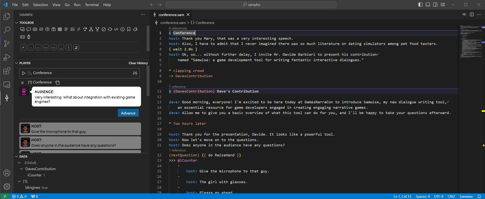

# Overview

**Samwise™** is a game development tool for writing complex interactive dialogues.

The objective of this tool is to empower writers and designers to craft intricate, branching narratives, providing comprehensive control over dialogue scripting. This allows for the creation of naturally flowing interactions that are essential for immersive gaming experiences.

**Samwise™** consists of three components:
1. A scripting language for writing interactive dialogues;
2. A runtime library for parsing such files and supporting the execution of dialogues in a videogame (or any other interactive software);
3. A Visual Studio Code extension that assists the developer in the task of writing dialogues and testing them quickly.



## A Basic Dialogue in Samwise

```samwise
§ DinnerPlans
* Bob and Alice are discussing where to go for dinner.

Alice> Where do you want to go for dinner tonight?
Bob:
    - I'd like to go to the Japanese restaurant
        Alice> Do you prefer an all-you-can-eat buffet or a traditional restaurant?
        Bob:
            -- All-you-can-eat
                Bob> I prefer an all-you-can-eat buffet; I'm very hungry and don't want to spend a fortune.

            -- Traditional
                Bob> I prefer a traditional restaurant; we might pay more, but the quality is usually better.
        Alice> All right then.
```

## A More Complex Dialogue in Samwise

```samwise
§ DinnerPlans
[!General.sDecidedDinner]
    [once] 
        Bob> So, where should we go for dinner tonight?
    [else] 
        Alice> Alright, I've given it some thought and have a few ideas.
        Bob> Oh, really? What do you have in mind?
        Alice> I was thinking...

    Alice:
        <- [once] I feel like having Italian.
            Bob> Mmmh, we had Italian last week, didn't we?
            Alice> Yeah, but I love it! How about pizza?
            Bob> Any other options?

        <- [once] How about sushi?
            Bob> I'm not really in the mood for sushi tonight.
            Alice> Fair enough. Let's try something else.

        - Why don't we try something new?
            Bob> Something new? Like what?
            Alice:
                - How about that new Korean BBQ place?
                    Bob> Oh, I've heard good things about it. Let's give it a shot!
                    Alice> Great, I love grilling at the table.
                    { General.sDecidedDinner = KOREAN }

                - Maybe Indian food?
                    Bob> Indian sounds good. I could go for some spicy curry.
                    Alice> Perfect, let's go to Maharaja's.
                    { General.sDecidedDinner = INDIAN }

                - Surprise me!
                    Bob> Surprise you? All right, but don't blame me if you don't like it!
                    Alice> Don't worry, I trust your taste.
                    Bob> Okay, how about..
                    %
                        - [2x]
                            Bob> A new Thai place downtown?
                            Bob> I've heard they have great Pad Thai.
                            Alice> Sounds good to me! Let's do it.
                            { General.sDecidedDinner = THAI }
                        -
                            Bob> A new Mexican place?
                            Bob> I could go for some tacos.
                            Alice> Tacos sound great! Let's go there.
                            { General.sDecidedDinner = MEXICAN }

        - I don't know. Maybe I should think about it a bit more.
            Bob> Come on, we have to eat something. Let's decide!
[else]
    // If they've already decided
    Bob> So, we're all set for dinner, right?
    [General.sDecidedDinner == KOREAN]
        Bob> We are going to that new Korean BBQ place, right?
    [else General.sDecidedDinner == INDIAN]
        Bob> We're going to Maharaja's for Indian food, right?
    [else General.sDecidedDinner == THAI]
        Bob> We're going to that new Thai place downtown, right?
    [else General.sDecidedDinner == MEXICAN]
        Bob> We're going to that new Mexican place, right?
    Alice> Yep, let's go!
```

## Licensing

**Samwise™** is free to be used in commercial and non-commercial products, but it requires you to attribute the work in the manner specified in the [License](LICENSE.md). For example, in order to be used in a video game it's enough to include the ["written in Samwise" logo](logo/samwise-both-large.png) and/or the acknowledgment "Samwise™ Dialogue System by Davide 'PeevishDave' Barbieri" in the credits screen.

**Samwise™**'s license covers the description of the language and the runtime library, but it does not extend to the dialogues you write in that language. Your narrative is, of course, entirely your property.

## How can you help me

Please consider to support my work on [Github Sponsors](https://github.com/sponsors/davidebarbieri)!

I also appreciate all feedback, bug reports, and user suggestions regarding the use of Samwise. Your insights are invaluable in improving its functionality and user experience. 

!> Please note that while I am delighted to see Samwise being utilized in video game projects made by other developers, it remains a personal project mainly driven by fun, and as such, **I do not accept pull requests**. If you have suggestions for improvement, I kindly ask that you specify what aspect you'd like to see enhanced rather than providing direct code contributions. This approach ensures that any modifications align with the original vision and maintain the enjoyment of the project for its creator.
