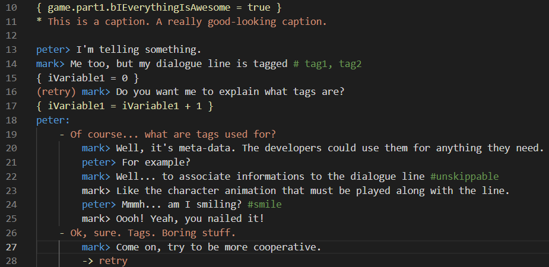
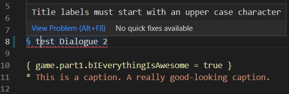
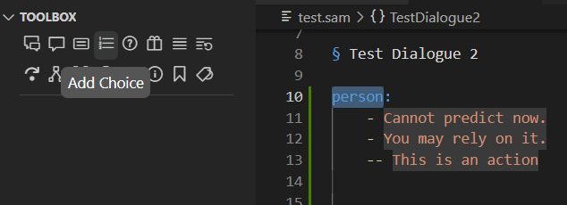
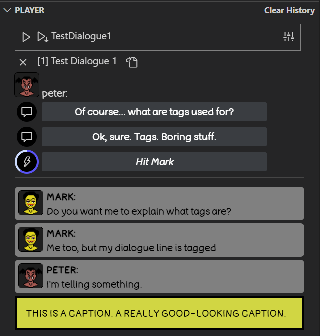
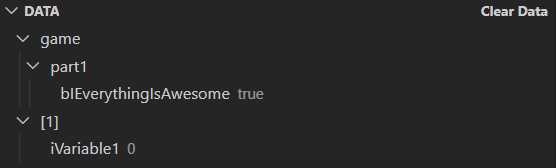

# Samwise Visual Studio Code extension README

This is the README for the Samwise Dialogue System Visual Studio Code extension.
**Samwise™** is a game development tool for writing interactive dialogues. 

**Samwise™** consists of three components:
1. A scripting language for writing interactive dialogues;
2. A runtime library for parsing such files and supporting the execution of dialogues in a videogame;
3. A Visual Studio Code extension (this extension) that assists the developer in the task of writing dialogues and testing them quickly.

You can find the first two components in the official [repository](https://github.com/davidebarbieri/samwise).

Please consider to support my work on [Github Sponsors](https://github.com/sponsors/davidebarbieri)!

*WARNING: the current version of Samwise Dialogue System is not to be considered stable.
It's still in an early stage of development, so the language specification, the runtime library
and the Visual Studio Code extension are meant to be changed at any time without the guarantee
of being backward compatible with previous versions.*

## Features

This extension provides a set of features useful to write in Samwise language:

### Syntax Highlighting
Syntax highlighting makes it easier to read and write dialogues by applying different colors to different parts of the text. This can help you quickly identify narrative content, keywords, variables, and comments, and make it easier to spot syntax errors and other mistakes.

### Error Diagnostics
As you are writing your dialogues in Samwise, errors will be automatically highlighted on the text. By hovering your mouse over the highlighted text, a tooltip will show the error message.

### Toolbox
A toolbox with Samwise's most useful nodes.
If you do not remember the syntax of a specific node type (such as Choice, Random, or Sequence), clicking on the relevant button in the toolbox will insert an example snippet into the text.

### Dialogue Preview

This Visual Studio Code extension allows you to "play" dialogs directly within the editor. This allows you to preview and debug any dialog without having to run the whole game.
The Samwise Player allows you to start the preview from any node, even if it is in the middle of a dialogue.

### Data Visualizer/Editor

The Samwise dialogue system supports a simplified scripting language through the use of code nodes. Such nodes can read and write variables. The Data panel is a tool for viewing and changing the state of such variables.

## Requirements

This extension has no specific requirements for writing and previewing interactive dialogues. Anyway, if you want to integrate them into a game, at the moment C# is the only supported target language, via the runtime library that you can find in the official [repository](https://github.com/davidebarbieri/samwise).

## Documentation

You'll find the Samwise official documentation [here](https://github.com/davidebarbieri/samwise).